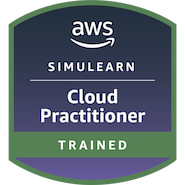

# Hi, I'm Shiham Ahamed 

  
  

## 👨‍💻 About Me

* 🎓 Software Engineering undergraduate at **SLIIT**
* 🧩 Building full-stack applications, backend APIs, and distributed systems
* ☁️ Interested in cloud engineering, DevOps, testing, and reliable delivery
* 📍 Based in Colombo, Sri Lanka

## 🛠️ Tech Stack

  

## 🚀 Featured Work

  <a href="https://github.com/theShihamAhamed/shiham-ahamed-portfolio"><b>Portfolio Platform</b></a>
  &nbsp;•&nbsp;
  <a href="https://github.com/theShihamAhamed/ZUZI-ecommerce-microservices-monorepo"><b>ZUZI Microservices</b></a>
  &nbsp;•&nbsp;
  <a href="https://github.com/theShihamAhamed/BiteNow-food-delivery-backend"><b>BiteNow API</b></a>
  &nbsp;•&nbsp;
  <a href="https://github.com/theShihamAhamed/DevOps-playground"><b>DevOps Playground</b></a>

## 🏅 AWS Credential

  
   
  <b>AWS SimuLearn – Cloud Practitioner</b> · Click the badge to verify on Credly

---

  <b>Building reliable software, one system at a time.</b>

